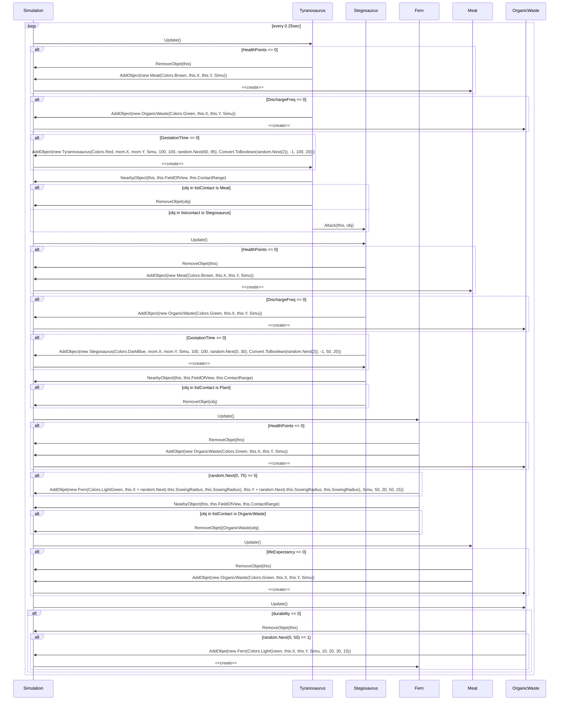
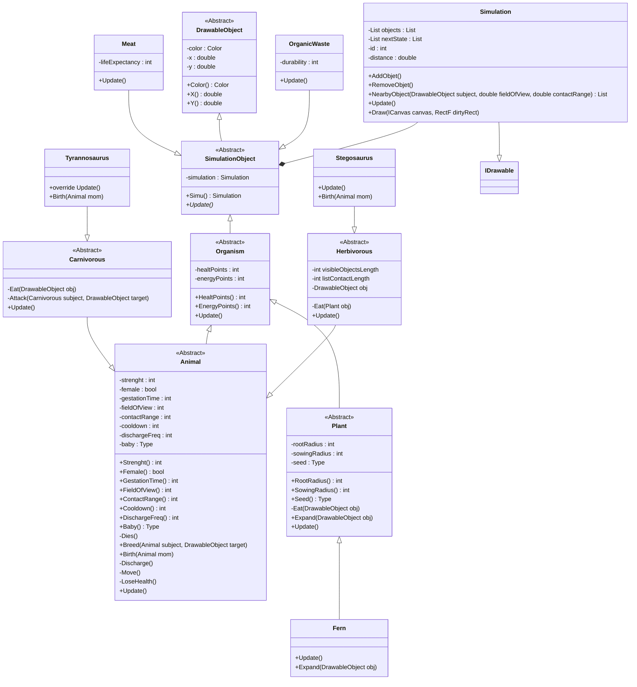

# Simulation de dinosaures!
## Découverte des entités
Toutes les formes de vie disposent de points d'énergie. Lorsque l'énergie est épuisée, des points de vie sont convertis en énergie.
Chaque tour, l'énergie de chaque forme de vie est décrémentée. Une fois tout sa vie épuisée, l'entité meurt. La carte est en wraparound.
### Animaux `Animals`
- Se déplacent
- Ont une zone de vision et une zone d'action: les animaux se dirigent vers les entités intéressantes présentes dans leur zone de vision, et peuvent interagir avec une fois celles-ci dans leur zone d'action
- Se transforment en viande à la fin de leur vie: prédation ou mort naturelle
- Peuvent se reproduire avec un semblable de sexe opposé: un petit apparaitra après une période de gestation[^1]

[^1]: Les dinosaures sont ovipares mais on fera comme si de rien n'était ;-)

#### Carnivores `Carnivorous` 
- Attaquent et pourchassent tous les herbivores
- Mangent de la viande
- Forts points d'attaque

Exemple: `Tyrannosaurus`

#### Herbivores `Herbivorous`  
- Mangent des plantes
- Faibles points d'attaque

Exemple: `Stegosaurus`

### Plantes `Plants`  
- Mangent les déchets organiques situés dans leur zone de racines
- Se transforment en déchet organique à leur mort
- Réplication dans leur zone de semis
	- Faible chance à chaque tour
	- Grande chance à l'absorption d'un déchet organique 

Exemple: `Fern`

### Viande `Meat` 
- Se transforme en déchet organique après un certain temps

### Déchets organiques `OrganicWaste` 
- Disparait après un certain temps
- Petite chance de génére une plante en disparaissant

## Gestion des interactions
Chaque entité calcule la distance à toute entité existante par le théorème de Pythagore: `r² = (x-a)² + (y-b)²`. 
Si une cible se trouve dans le rayon d'action, son type est analysé et un comportement adapté est choisi. Si une cible est dans le rayon de visibilité, l'animal avance de quelques pas dans sa direction.

## Principes SOLID

### Depency Inversion Principle
Le depency inversion principal veut que les sous classes ne dépendent que de classe abstraite. Ce qui aide à maintenir un autre principe SOLID qui est l’ « Open/close principle ». Dans notre projet, toutes les classes concrêtes héritent de classe abstraite et des classes abstraites héritent eux-mêmes d’autres classes abstraites. Ceci est possible car, dans notre cas, nous ne devons jamais instancier les classes dont hérite les classes concrêtes, nous avions pu donc toutes les passer en mode abstraites.

### Open/close Principle
Le open/close principle veut que le code soit ouvert aux extensions et fermé à la modification. Dans notre projet, l’utilisation des classes abstraites nous permette en partie de respecter ce principe. De plus, la création d’une nouvelle classe d’une espèce carnivore, par exemple, ne nous obligera pas à modifier quelconque classe supérieur. Ce qui valide l’ajout d’extension et la fermeture à la modification.

## Diagrammes UML

---
Diagramme de séquences
---

---
Diagramme de classes
---

